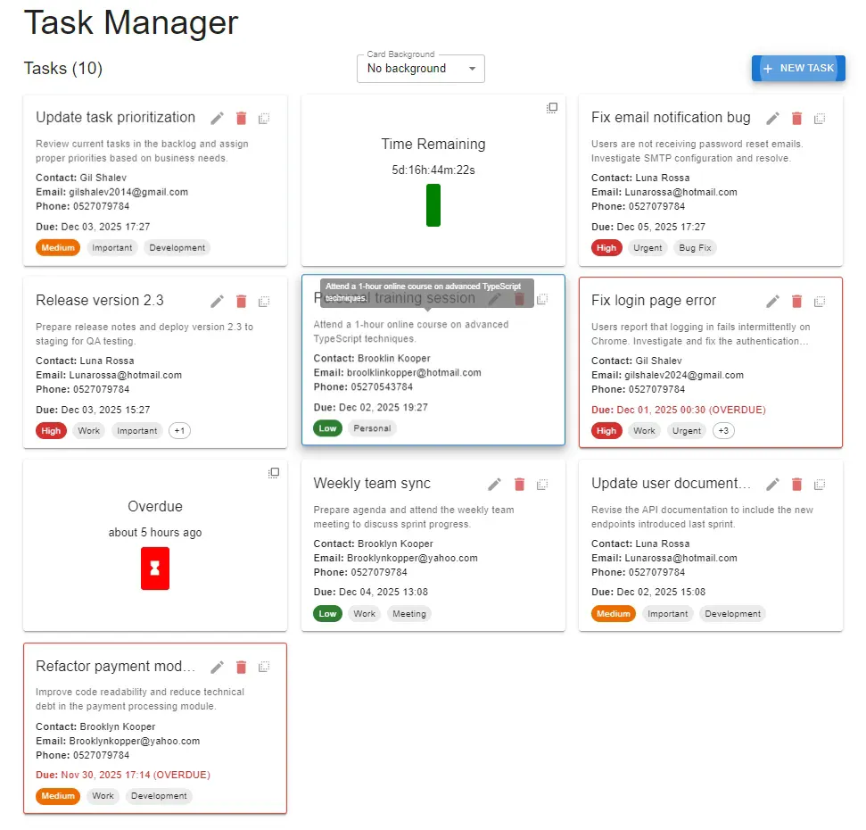
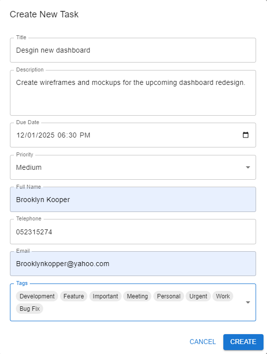

# Task Manager Application

Full-stack task management application with .NET Core, React, SQL Server, and RabbitMQ.

## 🏗️ Architecture

- **Backend**: .NET Core 9.0 Web API
- **Frontend**: React 19 with TypeScript + Vite
- **Database**: SQL Server 2022 (Docker)
- **Message Queue**: RabbitMQ (Docker)
- **State Management**: Redux Toolkit

## 📸 Application Screenshots

### Task Management Dashboard

*Main dashboard displaying all tasks in a card-based layout with priority indicators, due dates, contact information, and tag management. Features include overdue task detection, time remaining countdown, and quick action buttons for edit and delete operations.*

### Create/Edit Task Form

*Comprehensive task creation form with real-time validation for all fields including title, description, due date picker, priority selection (Low/Medium/High), contact details (name, phone, email), and multi-select tag assignment from predefined categories.*

### System Flow Diagram

```
┌─────────────────────┐
│   Frontend (React)  │
│  http://localhost:  │
│        3000         │
└──────────┬──────────┘
           │
           │ HTTP REST API calls
           │
           ▼
┌─────────────────────┐
│   Backend API       │
│ .NET Core 9 Web API │
│  http://localhost:  │
│        7000         │
└──────┬──────────────┘
       │
       │ CRUD operations (EF Core)
       │
       ▼
┌─────────────────────┐         ┌──────────────────────┐
│   SQL Server 2022   │         │  TaskManager.Service │
│     (Docker)        │◄────────┤  Windows Service     │
│   localhost:1433    │         │  Background Worker   │
└─────────────────────┘         └──────┬───────────────┘
                                       │
                                       │ Publish/Consume
                                       │ overdue tasks
                                       ▼
                                ┌──────────────────────┐
                                │   RabbitMQ (Docker)  │
                                │   Queue: task-       │
                                │   reminders          │
                                │   localhost:5672     │
                                └──────────────────────┘

Flow:
1. User interacts with React Frontend
2. Frontend calls Backend API (REST)
3. API performs CRUD operations on SQL Server via EF Core
4. Windows Service polls SQL Server every minute for overdue tasks
5. Service publishes overdue task messages to RabbitMQ
6. Service consumes messages from RabbitMQ and logs reminders
```

## 📦 Project Structure
```
TaskManager/
├── docker-compose.yml             # Docker orchestration
├── Backend/
│   ├── TaskManager.sln
│   ├── TaskManager.Core/          # Domain models & DTOs
│   ├── TaskManager.Data/          # EF Core, Repositories
│   ├── TaskManager.API/           # Web API
│   ├── TaskManager.Service/       # Windows Service (RabbitMQ)
│   └── TaskManager.Tests/         # Unit tests
├── Frontend/
│   └── task-manager-ui/           # React + TypeScript
└── Database/
    └── Scripts/                   # SQL queries
```

## 🚀 Getting Started

### Prerequisites

**Required:**
- [.NET 9.0 SDK](https://dotnet.microsoft.com/download/dotnet/9.0)
- [Node.js 22.12+](https://nodejs.org/)
- [Docker Desktop](https://www.docker.com/products/docker-desktop) ⚠️ **Must be installed and running**

**Note:** Make sure Docker Desktop is running before proceeding with the setup.

### Clone the Repository
```bash
git clone https://github.com/GilShalev2017/SuperComTaskManagement.git
cd  SuperComTaskManagement
```

### Quick Setup with Docker Compose (Recommended)

The easiest way to get started is using Docker Compose:
```powershell
# Start all Docker containers (SQL Server + RabbitMQ)
docker-compose up -d

# Verify containers are running
docker-compose ps

# View logs (optional)
docker-compose logs -f
```

**This will start:**
- SQL Server 2022 on port `1433`
- RabbitMQ on port `5672`
- RabbitMQ Management UI on port `15672`
  (Username: guest
  Password: guest)

### Alternative: Manual Docker Setup

If you prefer to run containers individually:

#### SQL Server 2022
```powershell
docker run -d `
  --name sqlserver2022 `
  -e "ACCEPT_EULA=Y" `
  -e "SA_PASSWORD=Strong!Passw0rd" `
  -p 1433:1433 `
  -v C:\docker\sqlserver\data:/var/opt/mssql/data `
  -v C:\docker\sqlserver\backups:/var/opt/mssql/backups `
  mcr.microsoft.com/mssql/server:2022-latest
```

**Verify SQL Server is running:**
```powershell
docker ps | Select-String sqlserver
```

#### RabbitMQ with Management Console
```powershell
docker run -d `
  --name rabbitmq `
  -p 5672:5672 `
  -p 15672:15672 `
  -e RABBITMQ_DEFAULT_USER=guest `
  -e RABBITMQ_DEFAULT_PASS=guest `
  rabbitmq:3-management
```

**Verify RabbitMQ is running:**
```powershell
docker ps | Select-String rabbitmq
```

**Access RabbitMQ Management UI:**
- URL: http://localhost:15672
- Username: `guest`
- Password: `guest`

### Setup Backend

#### Option 1: Command Line (Quick Start)
```powershell
cd Backend/TaskManager.API

# Restore packages
dotnet restore

# Run the API
dotnet run
```

**API will be available at:** http://localhost:7000

**Swagger UI:** http://localhost:7000/swagger

#### Option 2: Visual Studio 2022 (Recommended for Debugging)

1. **Open the Solution**
   - Navigate to `Backend/` folder
   - Double-click `TaskManager.sln` to open in Visual Studio 2022

2. **Set Multiple Startup Projects**
   - Right-click on the solution in Solution Explorer
   - Select **"Configure Startup Projects..."**
   - Choose **"Multiple startup projects"**
   - Set both `TaskManager.API` and `TaskManager.Service` to **"Start"**
   - Click **OK**

3. **Run with Debugging**
   - Press **F5** or click the green "Start" button
   - This will launch both the API and the Windows Service simultaneously
   - You can set breakpoints in any project and debug in real-time

4. **Debug Individual Projects**
   - Right-click on `TaskManager.API` or `TaskManager.Service`
   - Select **"Debug" → "Start New Instance"**
   - This allows debugging one project at a time

**Benefits:**
- Full debugging support with breakpoints
- Immediate window for testing expressions
- Watch variables in real-time
- IntelliSense and code navigation
- Integrated SQL Server Object Explorer

#### Option 3: Visual Studio Code (Cross-Platform)

1. **Open the Backend Folder**
   ```powershell
   cd Backend
   code .
   ```

2. **Install Required Extensions**
   - C# Dev Kit (Microsoft)
   - C# (Microsoft)
   - NuGet Package Manager

3. **Configure Launch Settings**
   
   Create `.vscode/launch.json` in the Backend folder:
   ```json
   {
     "version": "0.2.0",
     "configurations": [
       {
         "name": "Launch API",
         "type": "coreclr",
         "request": "launch",
         "preLaunchTask": "build-api",
         "program": "${workspaceFolder}/TaskManager.API/bin/Debug/net9.0/TaskManager.API.dll",
         "args": [],
         "cwd": "${workspaceFolder}/TaskManager.API",
         "stopAtEntry": false,
         "serverReadyAction": {
           "action": "openExternally",
           "pattern": "\\bNow listening on:\\s+(https?://\\S+)"
         },
         "env": {
           "ASPNETCORE_ENVIRONMENT": "Development"
         }
       },
       {
         "name": "Launch Service",
         "type": "coreclr",
         "request": "launch",
         "preLaunchTask": "build-service",
         "program": "${workspaceFolder}/TaskManager.Service/bin/Debug/net9.0/TaskManager.Service.dll",
         "args": [],
         "cwd": "${workspaceFolder}/TaskManager.Service",
         "stopAtEntry": false,
         "env": {
           "DOTNET_ENVIRONMENT": "Development"
         }
       }
     ],
     "compounds": [
       {
         "name": "Launch API + Service",
         "configurations": ["Launch API", "Launch Service"],
         "presentation": {
           "order": 1
         }
       }
     ]
   }
   ```

4. **Configure Build Tasks**
   
   Create `.vscode/tasks.json` in the Backend folder:
   ```json
   {
     "version": "2.0.0",
     "tasks": [
       {
         "label": "build-api",
         "command": "dotnet",
         "type": "process",
         "args": [
           "build",
           "${workspaceFolder}/TaskManager.API/TaskManager.API.csproj",
           "/property:GenerateFullPaths=true",
           "/consoleloggerparameters:NoSummary"
         ],
         "problemMatcher": "$msCompile"
       },
       {
         "label": "build-service",
         "command": "dotnet",
         "type": "process",
         "args": [
           "build",
           "${workspaceFolder}/TaskManager.Service/TaskManager.Service.csproj",
           "/property:GenerateFullPaths=true",
           "/consoleloggerparameters:NoSummary"
         ],
         "problemMatcher": "$msCompile"
       }
     ]
   }
   ```

5. **Run and Debug**
   - Press **F5** or go to Run and Debug panel (Ctrl+Shift+D)
   - Select **"Launch API + Service"** from the dropdown
   - Click the green play button
   - Set breakpoints by clicking in the gutter next to line numbers

**Benefits:**
- Lightweight and fast
- Cross-platform (Windows, macOS, Linux)
- Integrated terminal
- Git integration
- Debugging support with breakpoints

### Setup Windows Service

#### Command Line (open in a new window)
```powershell
cd Backend/TaskManager.Service

# Restore packages
dotnet restore

# Run the service
dotnet run
```

**Service Log File:**
The Windows Service logs all activities including overdue task checks (every minute) to:
- **Location**: `Backend/TaskManager.Service/logs/taskmanager-service-YYYYMMDD.log`
  - Example: `taskmanager-service-20241130.log`
  - A new log file is created daily
- **Console Output**: Overdue task reminders are also printed to the console in real-time
- Monitor the log file to verify the service is running and checking for overdue tasks
- Each scan logs:
  - Timestamp of the check
  - Number of overdue tasks found
  - Details of each published reminder (Task ID, Title, Assignee, Due Date, Priority, Tags)
  - RabbitMQ message publishing status

**Note:** The service uses a "publish-once" algorithm - each overdue task is published to RabbitMQ only once per service run. Already-processed tasks are tracked in memory and won't be republished until the service restarts.

### Setup Frontend

#### Option 1: Command Line (open in a new window)
```powershell
cd Frontend/task-manager-ui

# Install dependencies
npm install

# Run the app
npm run dev
```

**Frontend will be available at:** http://localhost:3000

#### Option 2: Visual Studio Code (Recommended for React Development)

1. **Open the Frontend Folder**
   ```powershell
   cd Frontend/task-manager-ui
   code .
   ```

2. **Install Required Extensions**
   - ESLint
   - Prettier - Code formatter
   - ES7+ React/Redux/React-Native snippets
   - TypeScript Vue Plugin (Volar)

3. **Install Dependencies**
   - Open integrated terminal (Ctrl+` or View → Terminal)
   ```bash
   npm install
   ```

4. **Run Development Server**
   ```bash
   npm run dev
   ```
   - The app will open automatically at http://localhost:3000
   - Hot Module Replacement (HMR) enabled - changes reflect instantly

5. **Debug React Components**
   - Install **"Debugger for Chrome"** extension
   - Create `.vscode/launch.json`:
   ```json
   {
     "version": "0.2.0",
     "configurations": [
       {
         "type": "chrome",
         "request": "launch",
         "name": "Launch Chrome against localhost",
         "url": "http://localhost:3000",
         "webRoot": "${workspaceFolder}/src"
       }
     ]
   }
   ```
   - Press **F5** to start debugging
   - Set breakpoints in React components (.tsx files)

**Benefits:**
- React component debugging with breakpoints
- Redux DevTools integration
- Real-time error highlighting
- Auto-formatting with Prettier
- IntelliSense for TypeScript and React

#### Running All Three Projects Together

**Recommended Setup:**
1. **Terminal 1**: Run Docker containers
   ```powershell
   docker-compose up -d
   ```

2. **Visual Studio 2022**: Run Backend API + Windows Service
   - Open `Backend/TaskManager.sln`
   - Set multiple startup projects
   - Press F5

3. **VS Code**: Run Frontend
   - Open `Frontend/task-manager-ui`
   - Run `npm run dev` in terminal

This setup allows you to:
- Debug backend C# code in Visual Studio
- Debug frontend React/TypeScript code in VS Code
- View real-time logs from all services
- Set breakpoints across the entire stack

## 🗄️ Database Management (Optional)

### SQL Server Management Studio (SSMS)

For inspecting the database, running queries, or troubleshooting:

1. **Download SSMS** (if not installed)
   - [Download from Microsoft](https://aka.ms/ssmsfullsetup)
   - Free tool for managing SQL Server

2. **Connect to Docker SQL Server**
   - Open SSMS
   - **Server name**: `localhost,1433`
   - **Authentication**: SQL Server Authentication
   - **Login**: `sa`
   - **Password**: `Strong!Passw0rd`
   - Click **Connect**

3. **Useful Operations**
   - View/edit data in tables
   - Run the custom SQL query (see [Database Schema](#database-schema) section)
   - Inspect table structures and relationships
   - View query execution plans
   - Monitor active connections

**Quick Tips:**
- Expand **Databases → TaskManagerDB → Tables** to see all tables
- Right-click a table → **"Select Top 1000 Rows"** to view data
- Use **New Query** button to run custom SQL queries
- The [SQL Query for tasks with 2+ tags](#sql-query-tasks-with-at-least-two-tags) can be run directly here

**Alternative Tools:**
- **Azure Data Studio** - Cross-platform, modern UI
- **DBeaver** - Free, cross-platform database tool

## 🐳 Docker Management

### Using Docker Compose (Recommended)
```powershell
# Start all containers
docker-compose up -d

# Stop all containers
docker-compose down

# View logs
docker-compose logs -f

# View logs for specific service
docker logs sqlserver
docker logs taskmanager-rabbitmq

# Check container status
docker-compose ps
```

### Managing Individual Containers

#### SQL Server Commands
```powershell
# Start container
docker start sqlserver2022

# Stop container
docker stop sqlserver2022

# View logs
docker logs sqlserver2022

# Remove container (keeps volumes)
docker rm sqlserver2022


#### RabbitMQ Commands
```powershell
# Start container
docker start rabbitmq

# Stop container
docker stop rabbitmq

# View logs
docker logs rabbitmq

# Remove container
docker rm rabbitmq

# Access shell
docker exec -it rabbitmq bash
```

### Stop All Containers
```powershell
# With Docker Compose
docker-compose down

# Or manually
docker stop sqlserver taskmanager-rabbitmq
```

### Remove All Containers
```powershell
# With Docker Compose (removes containers but keeps volumes)
docker-compose down

# Remove containers and volumes (deletes all data)
docker-compose down -v

# Or manually
docker rm sqlserver taskmanager-rabbitmq
```

### View Running Containers
```powershell
# All running containers
docker ps

# With Docker Compose
docker-compose ps
```

## ⚙️ Configuration

### Database Connection String

Located in:
- `Backend/TaskManager.API/appsettings.json`
- `Backend/TaskManager.Service/appsettings.json`
```json
{
  "ConnectionStrings": {
    "DefaultConnection": "Server=localhost,1433;Database=TaskManagerDB;User Id=sa;Password=Strong!Passw0rd;TrustServerCertificate=True;"
  }
}
```

**Note:** Port `1433` is explicitly specified for Docker.

### RabbitMQ Configuration
```json
{
  "RabbitMQ": {
    "HostName": "localhost",
    "Port": 5672,
    "UserName": "guest",
    "Password": "guest",
    "QueueName": "task-reminders"
  }
}
```

## 🧪 Testing

### Sample Data

A SQL script is provided to quickly populate the database with sample tasks for testing purposes:
- **Location**: `Database/Scripts/InsertSampleTasks.sql`
- **Contents**: Sample tags, tasks with various priorities and due dates, N:N relationships, and overdue tasks for testing the reminder service
- **Usage**: Run the script using SSMS or any SQL Server management tool

### Backend Tests
```powershell
cd Backend/TaskManager.Tests
dotnet test
```

### Frontend Tests
```powershell
cd Frontend/task-manager-ui
npm test
```

## 📊 Database Schema

### Tables

**Tasks**
- Id (int, PK)
- Title (nvarchar(200), required)
- Description (nvarchar(2000))
- DueDate (datetime2, required)
- Priority (int, required) [1=Low, 2=Medium, 3=High]
- FullName (nvarchar(100), required)
- Telephone (nvarchar(20), required)
- Email (nvarchar(100), required)
- CreatedAt (datetime2)
- UpdatedAt (datetime2)

**Tags**
- Id (int, PK)
- Name (nvarchar(50), required, unique)

**TaskTags** (Join Table)
- TaskId (int, FK)
- TagId (int, FK)

### SQL Query: Tasks with At Least Two Tags
```sql
SELECT 
    t.Id,
    t.Title,
    t.Description,
    t.DueDate,
    t.Priority,
    t.FullName,
    t.Email,
    t.Telephone,
    COUNT(tt.TagId) AS TagCount,
    STRING_AGG(tag.Name, ', ') AS TagNames
FROM 
    Tasks t
INNER JOIN 
    TaskTags tt ON t.Id = tt.TaskId
INNER JOIN 
    Tags tag ON tt.TagId = tag.Id
GROUP BY 
    t.Id, t.Title, t.Description, t.DueDate, t.Priority, 
    t.FullName, t.Email, t.Telephone
HAVING 
    COUNT(tt.TagId) >= 2
ORDER BY 
    TagCount DESC, t.Title ASC;
```

## 🎯 Key Features

- ✅ Full CRUD operations for tasks
- ✅ Real-time validation on all fields
- ✅ N:N relationship between Tasks and Tags
- ✅ RabbitMQ message queue for task reminders
- ✅ Windows Service checks overdue tasks every minute
- ✅ Material-UI responsive design
- ✅ Redux Toolkit state management
- ✅ Entity Framework Core with Code First
- ✅ Repository Pattern + Unit of Work
- ✅ Comprehensive error handling
- ✅ Unit tests for backend and frontend

## 🔧 Troubleshooting

### Docker Desktop Not Running

**Problem:** "Cannot connect to the Docker daemon"

**Solution:**
1. Open Docker Desktop
2. Wait for it to start completely (whale icon in system tray should be steady)
3. Run `docker ps` to verify it's working

### SQL Server Connection Issues

**Problem:** Cannot connect to SQL Server

**Solution:**
```powershell
# Check if container is running
docker-compose ps
# or
docker ps

# If not running, start it
docker-compose up -d sqlserver
# or
docker start sqlserver2022

# Check logs for errors
docker-compose logs sqlserver
# or
docker logs sqlserver2022

# Test connection
docker exec -it sqlserver2022 /opt/mssql-tools/bin/sqlcmd -S localhost -U sa -P "Strong!Passw0rd" -Q "SELECT @@VERSION"
```

### RabbitMQ Connection Issues

**Problem:** Service cannot connect to RabbitMQ

**Solution:**
```powershell
# Check if container is running
docker-compose ps

# Start RabbitMQ
docker-compose up -d rabbitmq
# or
docker start rabbitmq

# Check logs
docker-compose logs rabbitmq
# or
docker logs rabbitmq

# Verify management UI is accessible
# Open http://localhost:15672 in browser
```

### Port Already in Use

**Problem:** Port 1433, 5672, or 15672 already in use

**Solution:**
```powershell
# Find process using port (example: 1433)
netstat -ano | findstr :1433

# Kill the process (replace PID with actual process ID)
taskkill /PID <PID> /F

# Or change port mapping in docker-compose.yml
# Edit docker-compose.yml and change:
# ports:
#   - "1434:1433"  # Changed from 1433:1433
# Then update connection string to use port 1434
```

### Docker Compose Issues

**Problem:** `docker-compose` command not found

**Solution:**
Docker Desktop includes Docker Compose. Make sure:
1. Docker Desktop is installed and running
2. Try `docker compose` (without hyphen) - newer versions use this syntax
3. Or use PowerShell: `docker-compose` should work

## 📋 API Endpoints

### Tasks
- `GET /api/tasks` - Get all tasks
- `GET /api/tasks/{id}` - Get task by ID
- `POST /api/tasks` - Create new task
- `PUT /api/tasks/{id}` - Update task
- `DELETE /api/tasks/{id}` - Delete task

### Tags
- `GET /api/tags` - Get all tags
- `POST /api/tags` - Create new tag

## 🛑 Cleanup

When done with the assignment:
```powershell
# Stop all containers (using Docker Compose)
docker-compose down

# Or stop individual containers
docker stop sqlserver2022 rabbitmq

# Remove containers (keeps data volumes)
docker-compose down
# or
docker rm sqlserver2022 rabbitmq

# Remove containers AND volumes (deletes all data) - Use with caution!
docker-compose down -v
```

## 📝 Validation Rules

### Task Validation
- **Title**: Required, max 200 characters
- **Description**: Optional, max 2000 characters
- **Due Date**: Required, must be future date
- **Priority**: Required, 1-3 (Low/Medium/High)
- **Full Name**: Required, 2-100 characters
- **Telephone**: Required, valid phone format
- **Email**: Required, valid email format
- **Tags**: At least one tag required

## 🎓 Technologies Used

### Backend
- .NET Core 9.0
- Entity Framework Core 9.0
- FluentValidation
- Serilog
- xUnit, Moq (testing)

### Frontend
- React 19
- TypeScript
- Redux Toolkit
- Material-UI (MUI)
- React Hook Form
- Axios
- Vite

### Infrastructure
- SQL Server 2022 (Docker)
- RabbitMQ 3 (Docker)
- Docker Compose

## 📞 Access Points Summary

| Service | URL/Location | Credentials |
|---------|--------------|-------------|
| **Frontend** | http://localhost:3000 | N/A |
| **API** | http://localhost:7000 | N/A |
| **Swagger** | http://localhost:7000/swagger | N/A |
| **SQL Server** | localhost,1433 | User: `sa`<br>Password: `Strong!Passw0rd` |
| **RabbitMQ** | localhost:5672 | User: `guest`<br>Password: `guest` |
| **RabbitMQ UI** | http://localhost:15672 | User: `guest`<br>Password: `guest` |
| **Service Logs** | `Backend/TaskManager.Service/logs/taskmanager-service-YYYYMMDD.log` | N/A |

**Note:** Overdue task reminders are published to RabbitMQ and logged both to the log file and console output. See [Setup Windows Service](#setup-windows-service) section for details on the scanning algorithm.

## 📄 License

This project is for educational/evaluation purposes.